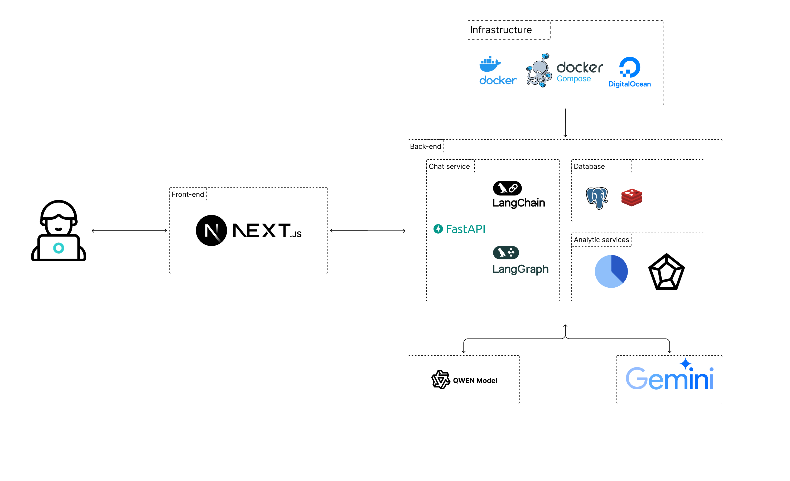

# Macro Mate

<div align="center">

  

**Your Friendly Macro Coach - AI-Powered Nutrition & Meal Planning Assistant**

[](LICENSE)
[](https://www.python.org/)
[](https://nextjs.org/)
[](https://fastapi.tiangolo.com/)
[](https://www.postgresql.org/)
[](https://github.com/yudhnaa/macro-mate/releases)

[Features](#key-features) • [Tech Stack](#technology-stack) • [Getting Started](#getting-started) • [API Docs](#api-documentation) • [Changelog](CHANGELOG.md) • [Contributing](#contributing)

</div>

## About

Macro Mate is an intelligent nutrition tracking and meal planning application that leverages AI to help users achieve their health and fitness goals. The application provides personalized nutrition advice, food recognition from images, macro tracking, and smart meal planning.

### Key Features

- **AI-Powered Food Recognition** - Upload food images for automatic nutritional analysis
- **Macro Tracking** - Track calories, protein, carbs, and fats effortlessly
- **Smart Meal Planning** - AI-generated meal plans based on your goals
- **Personalized Nutrition Advice** - Get expert guidance tailored to your profile
- **Progress Analytics** - Visualize your nutrition journey with interactive charts
- **Secure Authentication** - JWT-based user authentication and profile management

## Technology Stack

### **Backend**

- **Framework**: [FastAPI](https://fastapi.tiangolo.com/) - Modern, fast web framework for building APIs
- **Database**: [PostgreSQL](https://www.postgresql.org/) - Reliable relational database with pgvector extension
- **Caching**: [Redis](https://redis.io/) - In-memory data store for high-performance caching
- **AI/LLM Integration**:
  - [LangChain](https://langchain.com/) - Orchestration framework for LLM applications
  - [LangGraph](https://github.com/langchain-ai/langgraph) - State management for AI workflows
  - [Google Gemini](https://ai.google.dev/) - Advanced language model for text analysis
  - [OpenRouter](https://openrouter.ai/) - Multi-model API for vision tasks
- **Image Processing**: [Cloudinary](https://cloudinary.com/) - Cloud-based image management
- **Authentication**: JWT tokens with bcrypt password hashing
- **Database Migration**: [Alembic](https://alembic.sqlalchemy.org/) - Database migration tool
- **ORM**: [SQLAlchemy](https://www.sqlalchemy.org/) - Python SQL toolkit

### **Frontend**

- **Framework**: [Next.js 15](https://nextjs.org/) - React framework with server-side rendering
- **Language**: [TypeScript](https://www.typescriptlang.org/) - Type-safe JavaScript
- **UI Components**:
  - [Radix UI](https://www.radix-ui.com/) - Accessible component primitives
  - [Tailwind CSS](https://tailwindcss.com/) - Utility-first CSS framework
  - [Lucide Icons](https://lucide.dev/) - Beautiful icon library
- **State Management**: [Redux Toolkit](https://redux-toolkit.js.org/) - Efficient state management
- **HTTP Client**: [Axios](https://axios-http.com/) - Promise-based HTTP client
- **Data Visualization**: [Chart.js](https://www.chartjs.org/) + [react-chartjs-2](https://react-chartjs-2.js.org/) - Interactive charts

### **DevOps & Tools**

- **Containerization**: Docker & Docker Compose
- **Code Quality**:
  - Backend: Black, Flake8, isort, pre-commit
  - Frontend: ESLint
- **API Testing**: Postman collection included

### Architecture Diagram

<div align="center">
  
</div>

## Getting Started

### Prerequisites

- **Python** 3.12 or higher
- **Node.js** 20.x or higher
- **PostgreSQL** 15 or higher
- **Redis** 6.x or higher (optional but recommended)
- **Docker** & **Docker Compose** (for containerized deployment)

### Quick Start with Docker (Recommended)

This is the fastest way to get Macro Mate up and running:

```bash
# 1. Clone the repository
git clone https://github.com/yudhnaa/macro-mate.git
cd macro-mate

# 2. Set up backend environment
cd back-end
cp .env.example .env
# Edit .env with your API keys and configurations
nano .env

# 3. Start backend services (FastAPI + PostgreSQL + Redis)
docker-compose up -d

# 4. Set up frontend (in a new terminal)
cd ../frontend
cp .env.example .env
# Configure frontend environment variables
nano .env

# 5. Start frontend
docker-compose up -d
```

**Access the application:**

- Frontend: http://localhost:3000
- Backend API: http://localhost:8000
- API Documentation: http://localhost:8000/docs

### Local Development Setup

#### Backend Setup

```bash
# Navigate to backend directory
cd back-end

# Create and activate virtual environment
python -m venv venv
source venv/bin/activate  # On Windows: venv\Scripts\activate

# Install dependencies
pip install -r requirements.txt

# Set up environment variables
cp .env.example .env
# Edit .env with your configurations

# Initialize database
# Make sure PostgreSQL is running
# Create database: createdb macro_mate

# Run database migrations
alembic upgrade head

# Start development server
python main.py
# Or with uvicorn:
uvicorn main:app --reload --host 0.0.0.0 --port 8000
```

#### Frontend Setup

```bash
# Navigate to frontend directory
cd frontend

# Install dependencies
npm install
# Or with yarn: yarn install
# Or with pnpm: pnpm install

# Set up environment variables
cp .env.example .env
# Configure your API URL and other settings

# Start development server
npm run dev
# Or: yarn dev / pnpm dev

# Build for production
npm run build
npm run start
```

### Environment Configuration

#### Backend (.env)

```bash
# Security
SECRET_KEY=your-secret-key-here
ALGORITHM=HS256
ACCESS_TOKEN_EXPIRE_MINUTES=10080

# Database
DATABASE_HOST=localhost
DATABASE_PORT=5432
DATABASE_USER=postgres
DATABASE_PASSWORD=your-password
DATABASE_NAME=macro_mate

# Redis (optional)
REDIS_URL=redis://localhost:6379/0
REDIS_ENABLED=true

# AI/LLM APIs
GOOGLE_API_KEY=your-google-api-key
OPEN_ROUTER_API_KEY=your-openrouter-key

# Cloudinary
CLOUDINARY_CLOUD_NAME=your-cloud-name
CLOUDINARY_API_KEY=your-api-key
CLOUDINARY_API_SECRET=your-api-secret
```

#### Frontend (.env)

```bash
NEXT_PUBLIC_API_URL=http://localhost:8000/api/v1
```

## API Documentation

### Interactive Documentation

Once the backend is running, visit:

- **Swagger UI**: http://localhost:8000/docs - Interactive API testing
- **ReDoc**: http://localhost:8000/redoc - Clean API reference

### Comprehensive Documentation

For detailed API documentation, architecture diagrams, and component guides:

- **[API Reference](docs/API.md)** - Complete API endpoints documentation
- **[Architecture Guide](docs/ARCHITECTURE.md)** - System architecture and flow diagrams
- **[Component Docs](docs/COMPONENTS.md)** - Frontend component documentation
- **[Database Schema](docs/ARCHITECTURE.md#database-schema)** - Database structure and relationships

### Main API Endpoints

#### Authentication

- `POST /api/v1/auth/register` - Register new user
- `POST /api/v1/auth/login` - User login
- `GET /api/v1/auth/me` - Get current user

#### User Profile

- `GET /api/v1/profile` - Get user profile
- `PUT /api/v1/profile` - Update user profile
- `DELETE /api/v1/profile` - Delete user profile

#### Food Management

- `GET /api/v1/foods` - List all foods
- `POST /api/v1/foods` - Create food entry
- `GET /api/v1/foods/{id}` - Get food details
- `PUT /api/v1/foods/{id}` - Update food entry
- `DELETE /api/v1/foods/{id}` - Delete food entry

#### Analysis & Recognition

- `POST /api/v1/analyze/image` - Analyze food from image
- `POST /api/v1/analyze/text` - Analyze food from text description

#### Nutrition Advice

- `POST /api/v1/advice` - Get personalized nutrition advice

For detailed API documentation and testing, import the Postman collection:

```bash
back-end/Macro_Mate_Profile_API.postman_collection.json
```

## Project Structure

```
macro-mate/
├── back-end/                   # FastAPI backend
│   ├── alembic/               # Database migrations
│   ├── database/              # Database models and connection
│   ├── langgraph_flow/        # AI workflow state management
│   ├── models/                # LLM model integrations
│   │   ├── base/             # Base classes for LLM/VLM
│   │   └── providers/        # Gemini, OpenRouter implementations
│   ├── prompt/                # LLM prompt templates
│   ├── repository/            # Data access layer
│   ├── routers/               # API endpoints
│   ├── schema/                # Pydantic schemas
│   ├── services/              # Business logic
│   ├── utils/                 # Utilities (auth, logger, cache)
│   ├── config.py              # Application configuration
│   ├── main.py                # FastAPI application
│   └── requirements.txt       # Python dependencies
│
├── frontend/                   # Next.js frontend
│   ├── public/                # Static assets
│   ├── src/
│   │   ├── app/              # Next.js app router
│   │   │   ├── (auth)/       # Authentication pages
│   │   │   ├── (main)/       # Main application
│   │   │   └── (planner)/    # Meal planner
│   │   ├── components/       # React components
│   │   ├── features/         # Feature-specific logic
│   │   ├── hooks/            # Custom React hooks
│   │   ├── store/            # Redux store
│   │   ├── types/            # TypeScript types
│   │   └── utils/            # Utility functions
│   └── package.json          # Node.js dependencies
│
├── LICENSE                     # MIT License
└── README.md                  # This file
```

## Testing

### Backend Tests

```bash
cd back-end
pytest
```

### Frontend Tests

```bash
cd frontend
npm run lint
```

## Database Migrations

Create a new migration:

```bash
cd back-end
alembic revision --autogenerate -m "Description of changes"
```

Apply migrations:

```bash
alembic upgrade head
```

Rollback migration:

```bash
alembic downgrade -1
```

## Troubleshooting

### Backend Issues

**Database connection failed:**

- Ensure PostgreSQL is running: `pg_isready`
- Check database credentials in `.env`
- Verify database exists: `psql -l`

**Redis connection failed:**

- The app will work without Redis (with degraded caching)
- Start Redis: `redis-server` or `docker run -d -p 6379:6379 redis`
- Set `REDIS_ENABLED=false` to disable

**API key errors:**

- Verify `GOOGLE_API_KEY` and `OPEN_ROUTER_API_KEY` are set correctly
- Check API quota and billing status

### Frontend Issues

**API connection failed:**

- Ensure backend is running on http://localhost:8000
- Check `NEXT_PUBLIC_API_URL` in `.env`
- Verify CORS settings in backend

**Build errors:**

- Clear cache: `rm -rf .next`
- Reinstall dependencies: `rm -rf node_modules && npm install`

## Contributing

We welcome contributions from the community! Whether you're fixing bugs, adding features, or improving documentation, your help is appreciated.

### How to Contribute

1. **Fork the repository** and create your branch from `develop`
2. **Make your changes** following our coding standards
3. **Test your changes** thoroughly
4. **Submit a pull request** with a clear description

For detailed guidelines, please read [CONTRIBUTING.md](CONTRIBUTING.md) which covers:

- Development setup and workflow
- Coding standards for Python and TypeScript
- Pull request process
- Testing requirements
- Documentation guidelines

### Development Team

- **Macro Mate Development Team** (3 core contributors)

## License

This project is licensed under the MIT License - see the [LICENSE](LICENSE) file for details.

## Acknowledgments

- [FastAPI](https://fastapi.tiangolo.com/) for the excellent API framework
- [Next.js](https://nextjs.org/) for the powerful React framework
- [LangChain](https://langchain.com/) for LLM orchestration
- [Google Gemini](https://ai.google.dev/) for advanced AI capabilities
- All contributors and open-source projects that made this possible

## Support

- **Issues**: [GitHub Issues](https://github.com/yudhnaa/macro-mate/issues)
- **Repository**: [github.com/yudhnaa/macro-mate](https://github.com/yudhnaa/macro-mate)

## Maintained by: Macro Mate Development Team

- Phí Minh Quang - Contact: 2251012121quang@ou.edu.vn
- Phạm Đình Dương - Contact: 2251052025duong@ou.edu.vn
- Hoang Anh Duy - Contact: 2251012046@ou.edu.vn
