# Architecture Documentation

## Table of Contents

- [System Architecture](#system-architecture)
- [Database Schema](#database-schema)
- [API Flow Diagrams](#api-flow-diagrams)
- [Component Architecture](#component-architecture)
- [Data Flow](#data-flow)

## System Architecture

### [High-Level Architecture](../assets/high-level-architecture.png)

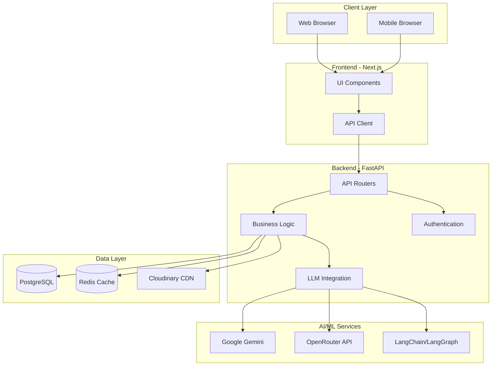

### [Technology Stack](../assets/technology-stack.png)

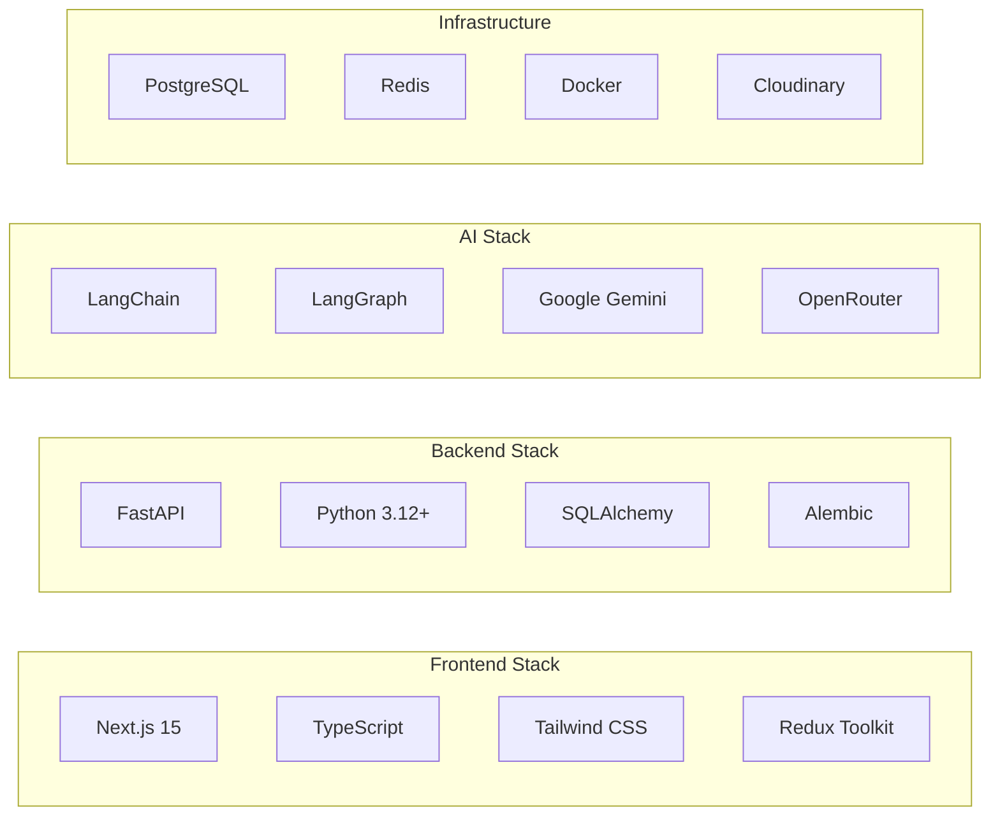

## Database Schema

### Public Schema

#### Users Table

Stores user account information and authentication data.

**Columns:**

- `id` (UUID, PK) - Unique user identifier
- `username` (VARCHAR) - Unique username
- `email` (VARCHAR) - User email address
- `hashed_password` (VARCHAR) - Bcrypt hashed password
- `created_at` (TIMESTAMP) - Account creation date
- `updated_at` (TIMESTAMP) - Last update timestamp

#### User Profiles Table

Contains detailed user profile and health information.

**Columns:**

- `id` (UUID, PK) - Profile identifier
- `user_id` (UUID, FK) - References users table
- `full_name` (VARCHAR) - User's full name
- `age` (INTEGER) - User age
- `gender` (VARCHAR) - Gender
- `weight` (FLOAT) - Current weight in kg
- `height` (FLOAT) - Height in cm
- `activity_level` (VARCHAR) - Activity level (sedentary, moderate, active)
- `goal` (VARCHAR) - Fitness goal (lose weight, maintain, gain muscle)
- `daily_calorie_target` (INTEGER) - Target calories per day
- `created_at` (TIMESTAMP)
- `updated_at` (TIMESTAMP)

#### Foods Table

Stores food items and their nutritional information.

**Columns:**

- `id` (UUID, PK) - Food item identifier
- `user_id` (UUID, FK) - Owner of the food entry
- `name` (VARCHAR) - Food name
- `calories` (FLOAT) - Calories per serving
- `protein` (FLOAT) - Protein in grams
- `carbs` (FLOAT) - Carbohydrates in grams
- `fats` (FLOAT) - Fats in grams
- `serving_size` (VARCHAR) - Serving size description
- `image_url` (VARCHAR) - Cloudinary image URL
- `created_at` (TIMESTAMP)

### Chat Schema
Used by LangGraph for conversation state management and checkpointing.

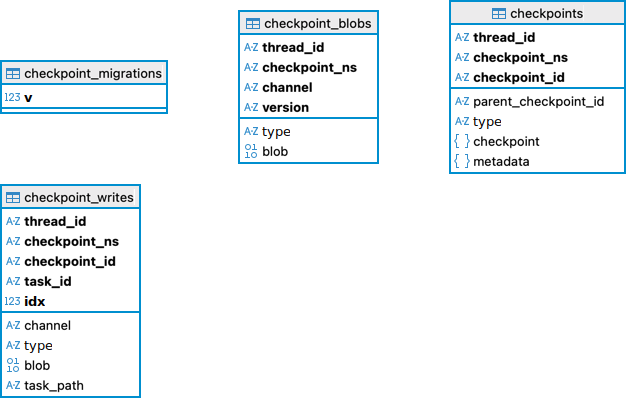

## API Flow Diagrams

### [User Registration Flow](../assets/user-registration-flow.png)

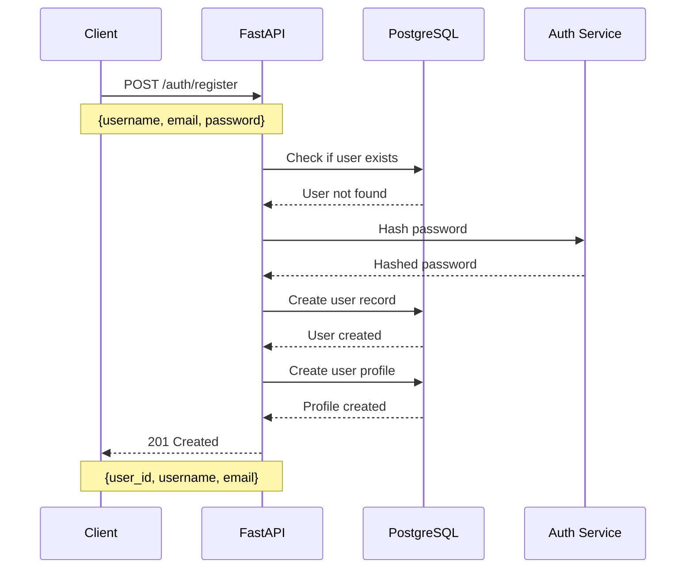

### [User Login Flow](../assets/user-login-flow.png)

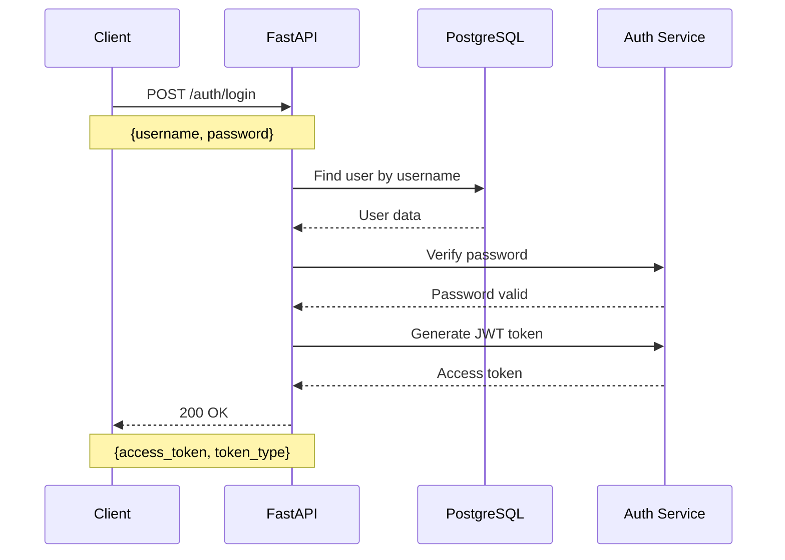

### [Food Image Analysis Flow](../assets/food-image-analysis-flow.png)

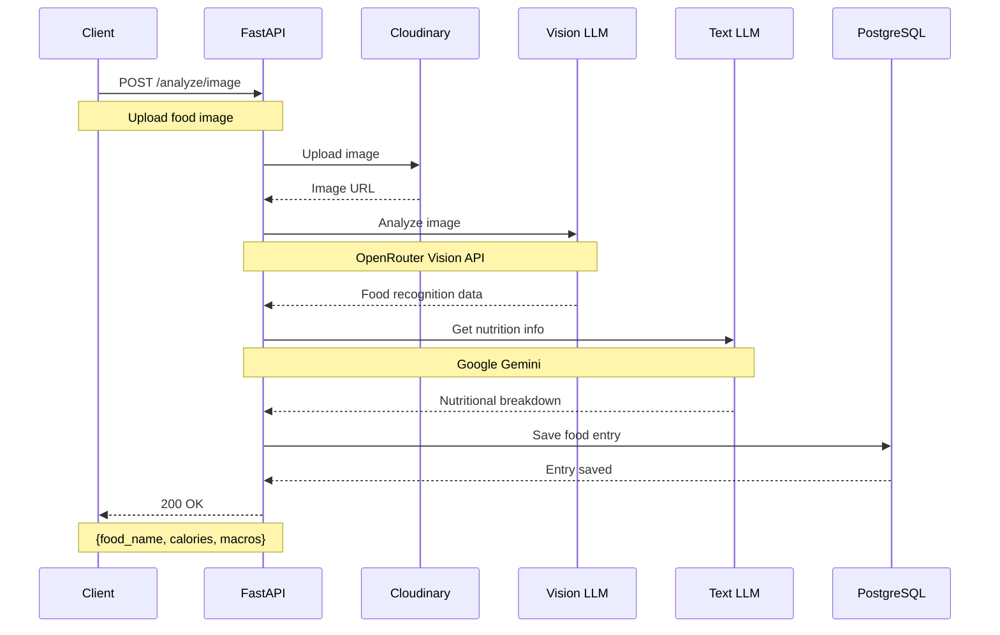

### [AI Nutrition Advice Flow](../assets/ai-nutrition-advice-flow.png)

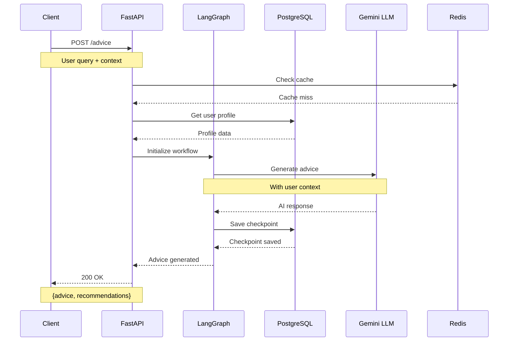

## Component Architecture

### [Frontend Component Hierarchy](../assets/frontend-component-hierarchy.png)

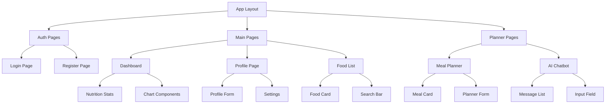

### [Backend Module Structure](../assets/backend-module-structure.png)

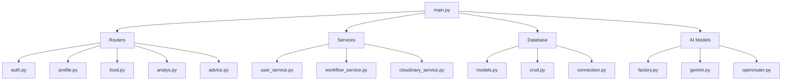

## Data Flow

### [User Authentication Data Flow](../assets/user-authentication-data-flow.png)

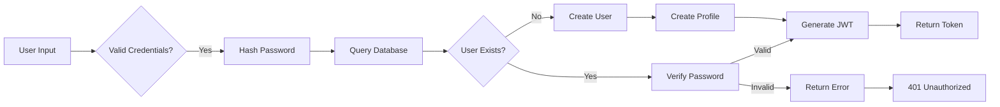

### [Food Entry Data Flow](../assets/food-entry-data-flow.png)

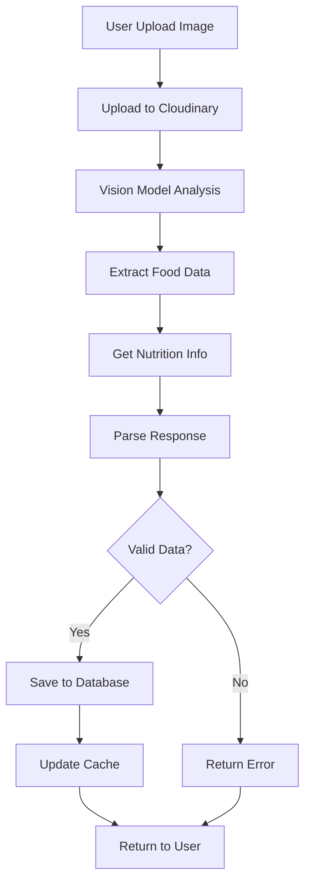

### [AI Advice Generation Flow](../assets/ai-advice-generation-flow.png)

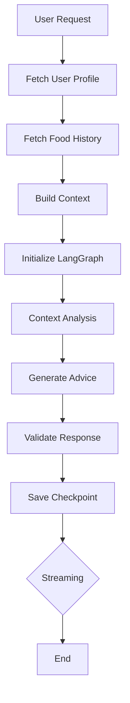

### [State Management Flow (Frontend)](../assets/state-management-flow-frontend.png)

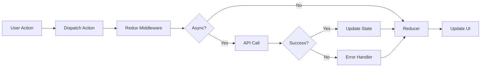

## Integration Points

### [External Services Integration](../assets/external-services-integration.png)

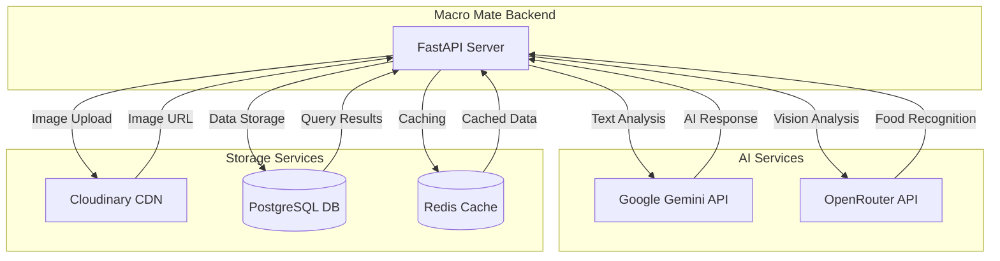

## [Deployment Architecture](../assets/deployment-architecture.png)

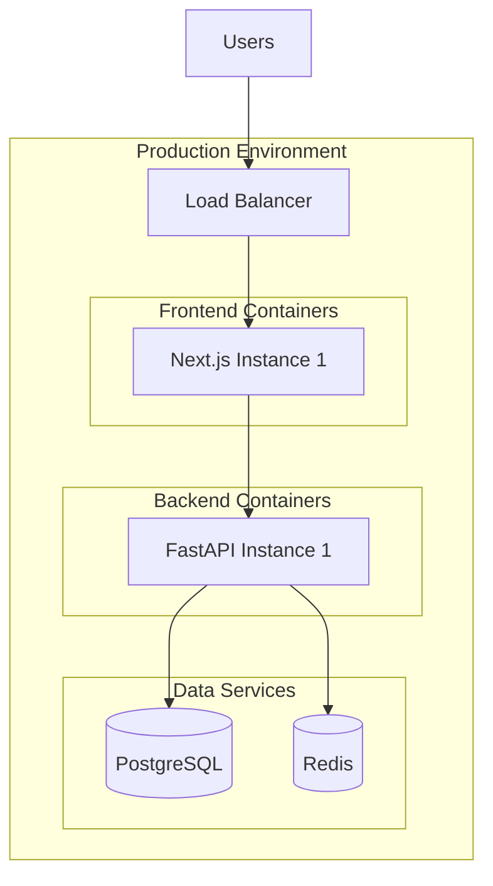

## [Security Architecture](../assets/security-architecture.png)

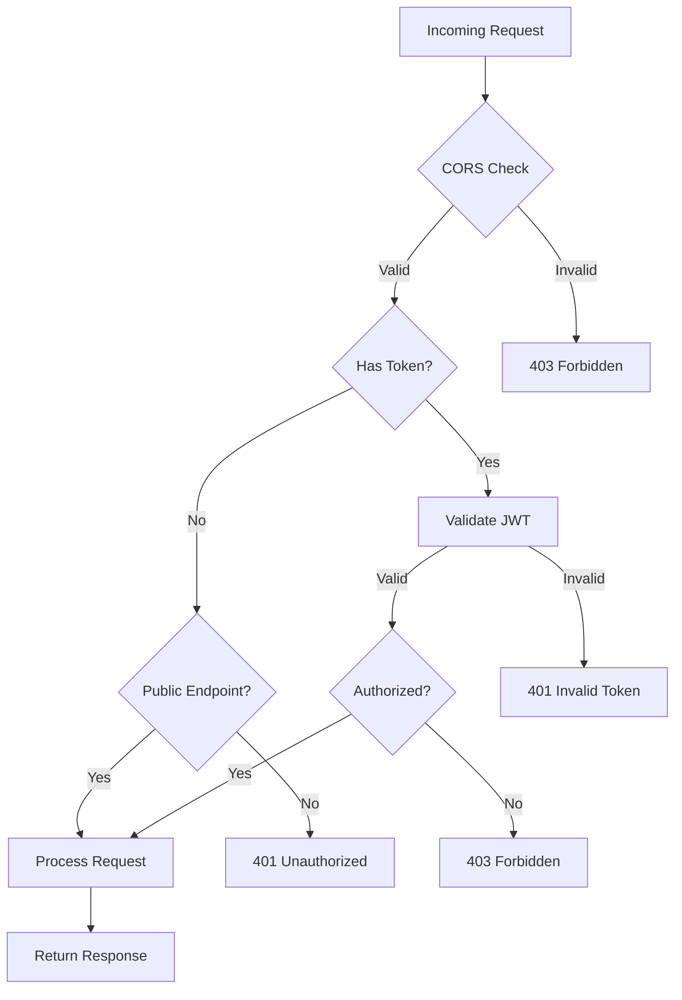

For more detailed information about specific components, please refer to:

- [API Documentation](../README.md#api-documentation)
- [Contributing Guide](../CONTRIBUTING.md)
- [Changelog](../CHANGELOG.md)
