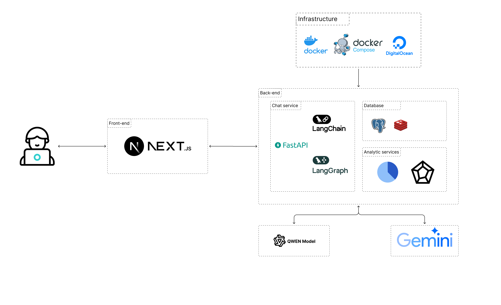

# Macro Mate Documentation

Welcome to the Macro Mate documentation! This guide will help you understand, use, and contribute to the project.

## Table of Contents

- [Getting Started](#getting-started)
- [Documentation Structure](#documentation-structure)
- [Quick Links](#quick-links)
- [For Developers](#for-developers)
- [For Users](#for-users)
- [For Contributors](#for-contributors)

---

## Getting Started

### New to Macro Mate?

1. Read the [Main README](../README.md) for complete project overview and features
2. Follow the [Setup Guide](../README.md#getting-started) for installation instructions
3. Explore the [API Documentation](API.md) to understand endpoints
4. Check the [Architecture Guide](ARCHITECTURE.md) to understand the system design

**All installation and setup instructions are centralized in the [Main README](../README.md#getting-started)**

---

## Documentation Structure

```
docs/
├── README.md           # This file - Documentation index
├── API.md             # Complete API reference
├── ARCHITECTURE.md    # System architecture & diagrams
└── COMPONENTS.md      # Frontend component guide
```

### Main Documents

| Document                              | Description                              | Audience                |
| ------------------------------------- | ---------------------------------------- | ----------------------- |
| [README.md](../README.md)             | Project overview, setup, features        | Everyone                |
| [API.md](API.md)                      | API endpoints, request/response examples | Developers, Integrators |
| [ARCHITECTURE.md](ARCHITECTURE.md)    | System design, flow diagrams             | Developers, Architects  |
| [COMPONENTS.md](COMPONENTS.md)        | Frontend component documentation         | Frontend Developers     |
| [CONTRIBUTING.md](../CONTRIBUTING.md) | Contribution guidelines                  | Contributors            |
| [CHANGELOG.md](../CHANGELOG.md)       | Version history and changes              | Everyone                |

---

## Quick Links

### Documentation

- [API Reference](API.md) - All API endpoints with examples
- [Architecture Diagrams](ARCHITECTURE.md) - Visual system design
- [Component Guide](COMPONENTS.md) - Frontend components
- [Database Schema](ARCHITECTURE.md#database-schema) - DB structure

### Interactive Tools

- [Swagger UI](http://localhost:8000/docs) - Try API endpoints
- [ReDoc](http://localhost:8000/redoc) - Clean API docs
- [Postman Collection](../back-end/Macro_Mate_Profile_API.postman_collection.json) - Import for testing

### Code & Repository

- [GitHub Repository](https://github.com/yudhnaa/macro-mate)
- [Issues](https://github.com/yudhnaa/macro-mate/issues)
- [Pull Requests](https://github.com/yudhnaa/macro-mate/pulls)
- [Releases](https://github.com/yudhnaa/macro-mate/releases)

---

## For Developers

### Backend Development

**Technology Stack:**

- FastAPI (Python 3.12+)
- PostgreSQL with pgvector
- Redis for caching
- LangChain/LangGraph for AI
- Google Gemini & OpenRouter

**Key Documentation:**

1. [API Endpoints](API.md) - All backend routes
2. [Database Schema](ARCHITECTURE.md#database-schema)
3. [Backend Architecture](ARCHITECTURE.md#system-architecture)
4. [Setup Guide](../README.md#backend-setup)

**Flow Diagrams:**

- [User Registration Flow](ARCHITECTURE.md#user-registration-flow)
- [Food Analysis Flow](ARCHITECTURE.md#food-image-analysis-flow)
- [AI Advice Flow](ARCHITECTURE.md#ai-nutrition-advice-flow)

### Frontend Development

**Technology Stack:**

- Next.js 15 with App Router
- TypeScript
- Tailwind CSS
- Redux Toolkit

**Key Documentation:**

1. [Component Guide](COMPONENTS.md) - All React components
2. [Custom Hooks](COMPONENTS.md#custom-hooks)
3. [State Management](COMPONENTS.md#state-management)
4. [Styling Guide](COMPONENTS.md#styling-guide)

**Component Examples:**

- [Authentication Components](COMPONENTS.md#authentication-components)
- [Food Collection](COMPONENTS.md#food-collection-components)
- [Meal Planner](COMPONENTS.md#planner-components)

### Database

**Schema Diagrams:**

- [Public Schema](../assets/database_diagram_public_schema.svg) - Users, profiles, foods
- [Chat Schema](../assets/database_diagram_chat_schema.svg) - LangGraph checkpoints

**Tables:**

- `users` - User accounts
- `user_profiles` - Health information
- `foods` - Food entries
- `checkpoints` - AI conversation state

### API Integration

**Authentication:**

```bash
# Login
POST /api/v1/auth/login
Content-Type: application/json

{
  "username": "user",
  "password": "pass"
}

# Use token
Authorization: Bearer <token>
```

**Examples:**

- [API Examples](API.md#sdk-examples)
- [Error Handling](API.md#error-handling)
- [Rate Limiting](API.md#rate-limiting)

---

## For Users

### Getting Started

1. **Register an account**

   - Go to http://localhost:3000/register
   - Create your profile with health goals

2. **Track your nutrition**

   - Upload food images for automatic analysis
   - Manually log meals
   - View daily statistics

3. **Get AI advice**
   - Chat with nutrition AI
   - Get personalized meal plans
   - Receive recommendations

### Features

- **AI Food Recognition** - Upload photos to identify food and calculate nutrition
- **Macro Tracking** - Monitor calories, protein, carbs, and fats
- **Meal Planning** - AI-generated meal plans based on your goals
- **Progress Analytics** - Visualize your nutrition journey
- **Smart Chatbot** - Get personalized nutrition advice

### Troubleshooting

Common issues and solutions: [Troubleshooting Guide](../README.md#troubleshooting)

---

## For Contributors

### How to Contribute

1. **Read the guidelines**

   - [CONTRIBUTING.md](../CONTRIBUTING.md) - Full contribution guide
   - [Code of Conduct](../CONTRIBUTING.md#code-of-conduct)

2. **Set up development environment**

   - [Development Setup](../CONTRIBUTING.md#development-setup)
   - [Coding Standards](../CONTRIBUTING.md#coding-standards)

3. **Make your contribution**
   - [Branch Naming](../CONTRIBUTING.md#branch-naming)
   - [Commit Messages](../CONTRIBUTING.md#git-commit-messages)
   - [Pull Request Process](../CONTRIBUTING.md#pull-request-process)

### Development Workflow


### Coding Standards

**Backend (Python):**

- Black for formatting
- Flake8 for linting
- Type hints required
- Docstrings for functions

**Frontend (TypeScript):**

- ESLint for linting
- TypeScript strict mode
- Functional components
- Proper prop typing

### Testing

```bash
# Backend tests
cd back-end
pytest

# Frontend linting
cd frontend
npm run lint
```

---

## Diagrams & Visuals

### System Architecture



### Database Schemas

- [Public Schema](../assets/database_diagram_public_schema.svg) - User data structure
- [Chat Schema](../assets/database_diagram_chat_schema.svg) - LangGraph checkpoints

### Application Flow Diagrams

All application flow diagrams (program execution flows) use Mermaid and are available in [ARCHITECTURE.md](ARCHITECTURE.md):

- **User Registration Flow** - How user accounts are created and validated
- **User Login Flow** - Authentication process and token generation
- **Food Image Analysis Flow** - Image upload, AI processing, and nutrition extraction
- **AI Nutrition Advice Flow** - Chatbot conversation and advice generation
- **Meal Planning Flow** - Meal plan creation using AI recommendations
- **Data Flow** - How data moves through the system components
- **State Management Flow** - Frontend state updates and API interactions

These diagrams show the runtime behavior and data flow of the application, not the development process.

---

## Additional Resources

### External Documentation

- [FastAPI Documentation](https://fastapi.tiangolo.com/)
- [Next.js Documentation](https://nextjs.org/docs)
- [LangChain Documentation](https://langchain.com/docs)
- [PostgreSQL Documentation](https://www.postgresql.org/docs/)

### Community

- [GitHub Issues](https://github.com/yudhnaa/macro-mate/issues) - Report bugs or request features
- [GitHub Discussions](https://github.com/yudhnaa/macro-mate/discussions) - Ask questions

### Release Notes

- [CHANGELOG.md](../CHANGELOG.md) - Version history
- [Releases](https://github.com/yudhnaa/macro-mate/releases) - Download specific versions

---

## License

This project is licensed under the MIT License - see the [LICENSE](../LICENSE) file for details.

---

## Need Help?

- Check [Troubleshooting](../README.md#troubleshooting)
- Search [existing issues](https://github.com/yudhnaa/macro-mate/issues)
- Create a [new issue](https://github.com/yudhnaa/macro-mate/issues/new)
- Read [CONTRIBUTING.md](../CONTRIBUTING.md) for contribution questions

---

**Last Updated:** October 23, 2025

**Version:** 0.2.0

**Maintained by:** Macro Mate Development Team
- Phí Minh Quang - Contact: 2251012121quang@ou.edu.vn
- Phạm Đình Dương - Contact: 2251052025duong@ou.edu.vn
- Hoang Anh Duy - Contact: 2251012046@ou.edu.vn
